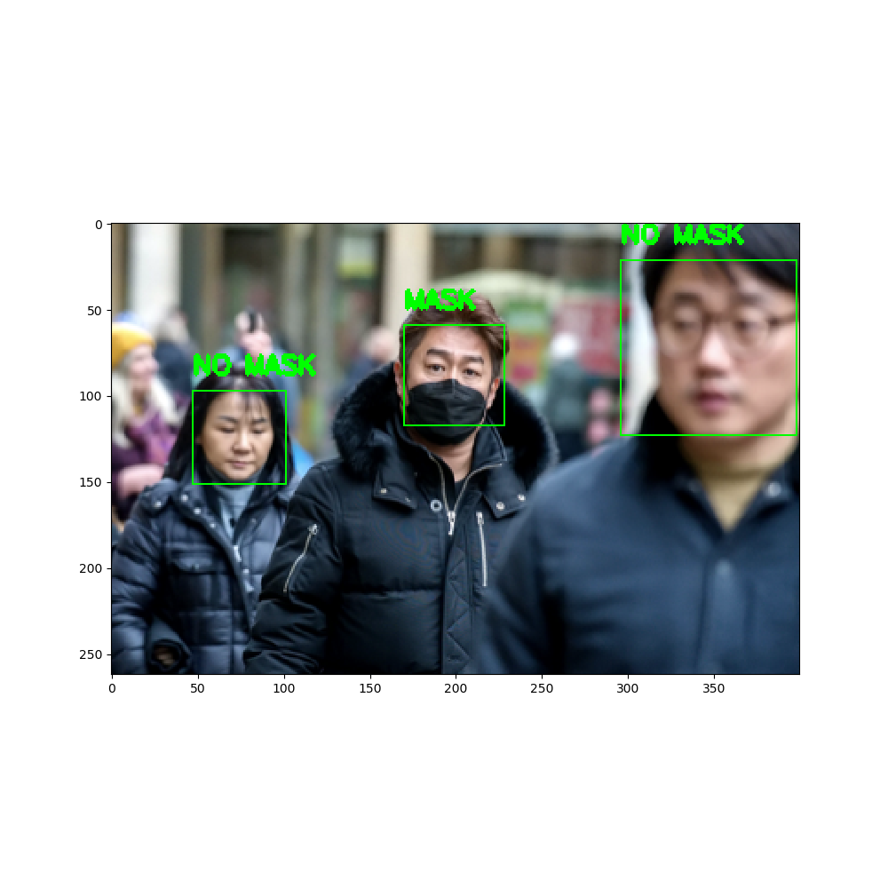
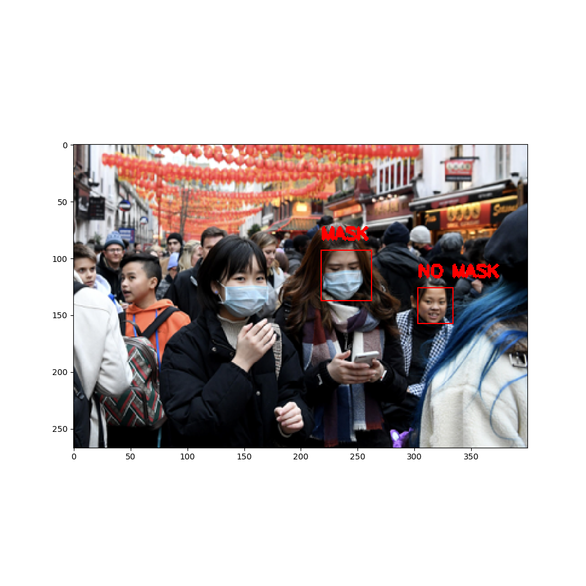

# 项目报告

# 使用VGG19实现口罩及社交距离检测

## 绪论

社交距离，也称为“物理距离”，是指在您和其他非您家庭的人之间保持安全空间。
我们的项目目标是建立一个深度学习模型，该模型可以识别该人是否戴口罩，还可以检测人们是否违反了社交距离规范。并且该程序不仅能识别静态图像，也能实时调用摄像头来进行检测。

主要方法：

* 首先，我们使用 haar 级联检测人脸
* 然后，我们通过迭代人脸的坐标并计算每个可能对的距离来完成，如果特定对的距离小于 MIN_DISTANCE，则这些人脸的边界框被涂成红色，否则为绿色。
* 我们使用VGG19来进行口罩检测
* 在最后一步中，我们通过OpenCV库运行一个无限循环程序，使用我们的网络摄像头，并且实时
  通过前面训练好的模型来进行检测。

## 细节与结果

#### 划分训练集和数据集，其中10000图片来训练，800张来测试。


#### 使用 haar 级联检测人脸

* 使用基于 Haar 特征的级联分类器的对象检测是 Paul Viola 和 Michael Jones 在他们的论文“Rapid Object Detection using a Boosted Cascade of Simple Features”于 2001 年提出的一种有效的对象检测方法。
* 这是一种基于机器学习的方法，其中级联函数是从大量正面和负面图像中训练出来的。然后使用它来检测其他图像中的对象。
* 我们使用经过训练的 Haar 级联模型来检测人脸，以获得图像中人脸的边界框坐标。

#### 检测社交距离

* 可以通过迭代人脸的坐标并计算每个可能对的距离来完成，如果特定对的距离小于 MIN_DISTANCE，则这些人脸的边界框被涂成红色，否则为绿色。
* MIN_DISTANCE 必须以对应于现实生活中的最小允许距离的方式手动初始化。

#### 使用VGG19来进行口罩检测

* VGG是Oxford的Visual Geometry Group的组提出的。该网络是在ILSVRC 2014上的相关工作，主要工作是证明了增加网络的深度能够在一定程度上影响网络最终的性能。简单来说，在VGG中，使用了3个3x3卷积核来代替7x7卷积核，使用了2个3x3卷积核来代替5*5卷积核，这样做的主要目的是在保证具有相同感知野的条件下，提升了网络的深度，在一定程度上提升了神经网络的效果。比如，3个步长为1的3x3卷积核的一层层叠加作用可看成一个大小为7的感受野（其实就表示3个3x3连续卷积相当于一个7x7卷积），其参数总量为 3x(9xC^2) ，如果直接使用7x7卷积核，其参数总量为 49xC^2 ，这里 C 指的是输入和输出的通道数。很明显，27xC2小于49xC2，即减少了参数；而且3x3卷积核有利于更好地保持图像性质。

* 构建VGG19模型


* 接下来我们训练模型

```python
model.compile(optimizer="adam",loss="categorical_crossentropy",metrics ="accuracy")

history = model.fit(train_generator,
                              steps_per_epoch=len(train_generator)//32,
                              epochs=20,validation_data=val_generator,
                              validation_steps=len(val_generator)//32)
```

* 通过测试集对模型进行测试

```
[0.06896067410707474, 0.9800000190734863]
```

结果显示有98%的准确率。

* 保存模型

```
model.save('masknet.h5')
```

#### 使用训练好的模型识别静态图像

```
face_model = cv2.CascadeClassifier('input/haarcascades/haarcascade_frontalface_default.xml')

#trying it out on a sample image
img = cv2.imread('input/face-mask-detection/images/maksssksksss40.png')

img = cv2.cvtColor(img, cv2.IMREAD_GRAYSCALE)

faces = face_model.detectMultiScale(img,scaleFactor=1.1, minNeighbors=4) #returns a list of (x,y,w,h) tuples

out_img = cv2.cvtColor(img, cv2.COLOR_RGB2BGR) #colored output image

#plotting
for (x,y,w,h) in faces:
    cv2.rectangle(out_img,(x,y),(x+w,y+h),(0,0,255),1)
#plt.figure(figsize=(12,12))
#plt.imshow(out_img)
#plt.show()

MIN_DISTANCE = 100

model = load_model('masknet.h5')
mask_label = {0:'MASK',1:'NO MASK'}
dist_label = {0:(0,255,0),1:(255,0,0)}
if len(faces) >= 1:
    label = [0 for i in range(len(faces))]
    for i in range(len(faces) - 1):
        for j in range(i + 1, len(faces)):
            dist = distance.euclidean(faces[i][:2], faces[j][:2])
            if dist < MIN_DISTANCE:
                label[i] = 1
                label[j] = 1
    new_img = cv2.cvtColor(img, cv2.COLOR_RGB2BGR)  # colored output image
    for i in range(len(faces)):
        (x, y, w, h) = faces[i]
        crop = new_img[y:y + h, x:x + w]
        crop = cv2.resize(crop, (128, 128))
        crop = np.reshape(crop, [1, 128, 128, 3]) / 255.0
        mask_result = model.predict(crop)
        cv2.putText(new_img, mask_label[mask_result.argmax()], (x, y - 10), cv2.FONT_HERSHEY_SIMPLEX, 0.5,
                    dist_label[label[i]], 2)
        cv2.rectangle(new_img, (x, y), (x + w, y + h), dist_label[label[i]], 1)
    plt.figure(figsize=(10, 10))
    plt.imshow(new_img)
    plt.show()

else:
    print("No. of faces detected is less than 1")
```

* 示例1



戴口罩的人是标注MASK，未戴口罩的人标注NO MASK。绿色框说明他们社交距离符合要求。

* 示例2



红色说明距离过近。

#### 使用摄像头动态检测

```
webcam = cv2.VideoCapture(0)  # Use camera 0
MIN_DISTANCE = 100
face_model = cv2.CascadeClassifier('input/haarcascades/haarcascade_frontalface_default.xml')
model = load_model('masknet.h5')
mask_label = {0: 'MASK', 1: 'NO MASK'}
dist_label = {0: (0, 255, 0), 1: (255, 0, 0)}
while True:
    rval, img = webcam.read()
    img = cv2.flip(img, 1, 1)  # Flip to act as a mirror


    img = cv2.cvtColor(img, cv2.IMREAD_GRAYSCALE)

    faces = face_model.detectMultiScale(img, scaleFactor=1.1, minNeighbors=4)  # returns a list of (x,y,w,h) tuples
    label = [0 for i in range(len(faces))]
    for i in range(len(faces) - 1):
        for j in range(i + 1, len(faces)):
            dist = distance.euclidean(faces[i][:2], faces[j][:2])
            if dist < MIN_DISTANCE:
                label[i] = 1
                label[j] = 1
    new_img = cv2.cvtColor(img, cv2.COLOR_RGB2BGR)  # colored output image
    for i in range(len(faces)):
        (x, y, w, h) = faces[i]
        crop = new_img[y:y + h, x:x + w]
        crop = cv2.resize(crop, (128, 128))
        crop = np.reshape(crop, [1, 128, 128, 3]) / 255.0
        mask_result = model.predict(crop)
        cv2.putText(new_img, mask_label[mask_result.argmax()], (x, y - 10), cv2.FONT_HERSHEY_SIMPLEX, 0.5,
                    dist_label[label[i]], 2)
        cv2.rectangle(new_img, (x, y), (x + w, y + h), dist_label[label[i]], 1)

    img=new_img
    img=cv2.cvtColor(img, cv2.COLOR_RGB2BGR)
    # Show the image
    cv2.imshow('LIVE', img)
    key = cv2.waitKey(10)
    # if Esc key is press then break out of the loop
    if key == 27:  # The Esc key
        break
# Stop video
webcam.release()

# Close all started windows
cv2.destroyAllWindows()
```

详细使用请参考视频演示，下面展示截图

* 1


#### 总结与讨论

* 通过分析和实验，我们最终完成了既定的最高目标。
* 但是最后结果也有不理想的地方，比如对人之间的距离判断有时会不准确
* 进行摄像头动态检测时需要环境有较好的光照。
* 在实验过程中，我们使用了更多的不同场景，不同人数图片来进行训练，使模型更具普适性。
* 网络上大部分口罩检测程序都只停留在了识别已拍摄好的图片上，我们更进一步，通过使用摄像头，我们重复的截取多帧图像并对其进行处理，然后进行检测，最后再显示出来。

#### 个人贡献

* 周希成28%
  项目的设计以及文档的编写，完善代码

* 张雨楼44%
  主要代码的编写以及测试，辅助文档的编写。
* 赵辰浩28%
  演示视频的拍摄和辅助代码，文档的编写。

#### 引用参考

###### 数据集

* https://www.kaggle.com/andrewmvd/face-mask-detection
* https://www.kaggle.com/ashishjangra27/face-mask-12k-images-dataset
* https://www.kaggle.com/lalitharajesh/haarcascades

###### 文献

* https://iq.opengenus.org/vgg19-architecture/
* https://www.jianshu.com/p/6aa903648ec5
* https://medium.com/analytics-vidhya/haar-cascades-explained-38210e57970d

#### 视频

地址：https://www.bilibili.com/video/BV1zS4y1T7PN/


